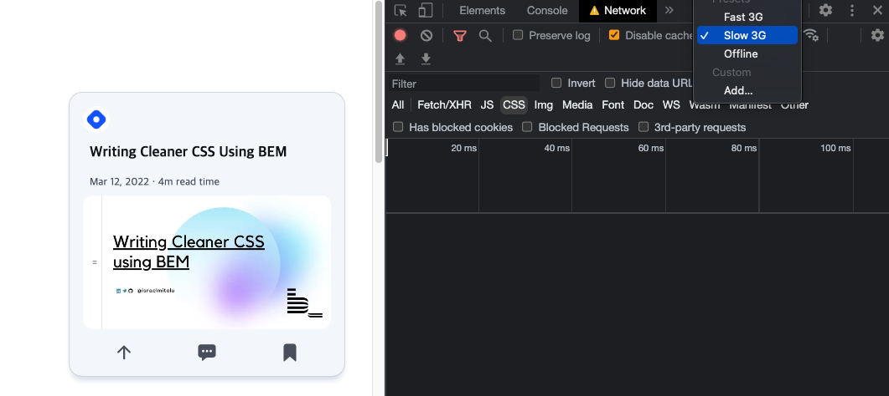

# SkeletonLoader
Skeleton Loader width CSS

- preview: https://charmmming7.github.io/SkeletonLoader

# What is a Skeleton Screens?
A skeleton screen is an animated placeholder that simulates the layout of a website while data is being loaded.

# Why Use Skeleton Screens?
- Leaving a blank screen when loading will make the user feel that the website loads slower, on the contrary, if using the Skeleton Loading screen when loading the website, it helps the user to foresee some content that will appear, so the feeling of the page loading will be faster.
- Skeleton screens draw the user's attention to progress rather than waiting time.

# How to check Skeleton Screens?

When the network speed is stable, the skeleton loading UI will not be visible, so we need to slow down the network speed. Get the result as below:

- Open DevTools > Navigate to the "Network" tab > Select the type of connection you want (Slow 3G)> Reload the page

- reference site: https://www.freecodecamp.org/news/how-to-build-skeleton-screens-using-css-for-better-user-experience
